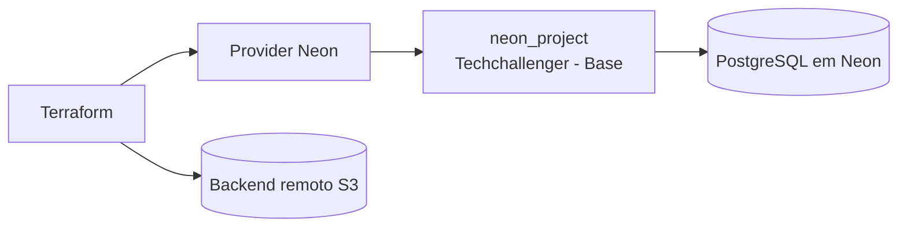

# TechChallengerFiap-DB

## Propósito

Este repositório é responsável pela provisionamento da infraestrutura de banco de dados do projeto TechChallengerFiap. Ele define, por meio de Terraform, a criação de um projeto PostgreSQL gerenciado pela plataforma Neon e organiza o estado remoto em backend S3.

## Tecnologias utilizadas

- Terraform
- Provider Neon (`kislerdm/neon`)
- PostgreSQL gerenciado pelo Neon
- AWS S3 para armazenamento do state do Terraform
- Neon DB serverless

## Arquitetura específica do repositório



A infraestrutura deste repositório não expõe endpoints HTTP diretamente. O papel principal é provisionar a base de dados que será consumida pela API principal do projeto.

## Passos para execução e deploy

### Pré-requisitos

- Terraform instalado
- Conta Neon ativa
- Credenciais AWS para o backend S3
- Variável de ambiente `NEON_API_KEY` configurada

### Execução local

```bash
cd TechChallengerFiap-DB/TFs
export NEON_API_KEY="sua-chave"
terraform init
terraform plan
terraform apply
```

### Validação

```bash
terraform validate
terraform plan
```

### Estrutura do projeto

```text
TechChallengerFiap-DB/
├── TFs/
│   ├── imports.tf
│   ├── provider.tf
│   ├── resources.tf
│   ├── variables.tf
│   ├── terraform.tfstate
│   └── terraform.tfstate.backup
├── README.md
└── ...
```

## Como o banco é usado pelo sistema

Os scripts SQL de criação da estrutura ficam no repositório da aplicação:

```text
TechChallengerFiap-Application/backEnd/db/init/
├── 01_clientes.sql
├── 02_veiculos.sql
├── 03_servicos.sql
├── 04_pecas.sql
├── 05_ordens_servico.sql
├── 06_os_servicos.sql
└── 07_os_pecas.sql
```

Esses scripts criam as tabelas de clientes, veículos, serviços, peças e ordens de serviço que a API utiliza.

## Link para Swagger / Postman

Este repositório não expõe documentação de API por si só, porque ele é apenas infraestrutura de banco. A documentação funcional da API está no repositório da aplicação:

- Swagger da API principal: http://localhost:3000/api-docs

## Observações operacionais

- O estado do Terraform é persistido em backend S3.
- A criação do projeto Neon deve ser feita com cuidado para não afetar o ambiente de produção sem revisão do plano.
- O valor da chave de API nunca deve ser commitado diretamente no repositório.

---
